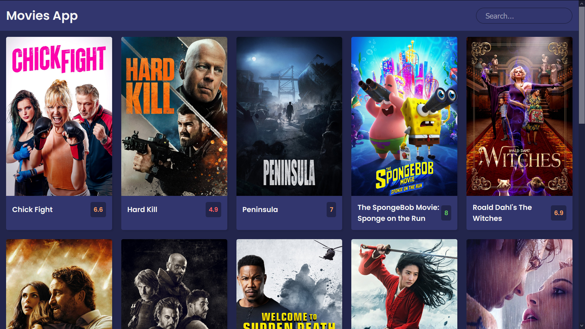

# Movies App

A clone application based on Project of [florinpop17](https://github.com/florinpop17 'Florin Pop')

## Live Preview

[Movies App](https://movies-react-app-seven.vercel.app/ 'Movies React App')

### Tech/framework used

<b>Built with</b>

-   [React](https://reactjs.org/)
-   [The Movie DB](https://api.themoviedb.org/3/)

### Installation and Setup Instructions

Clone down this repository. You will need `node` and `npm` installed globally on your machine.

Installation: `npm install`

To Start Server: `npm start`

To Visit App: `localhost:3000/`

#### By **[a12989x](https://github.com/a12989x, 'Alexis Guzman')**
